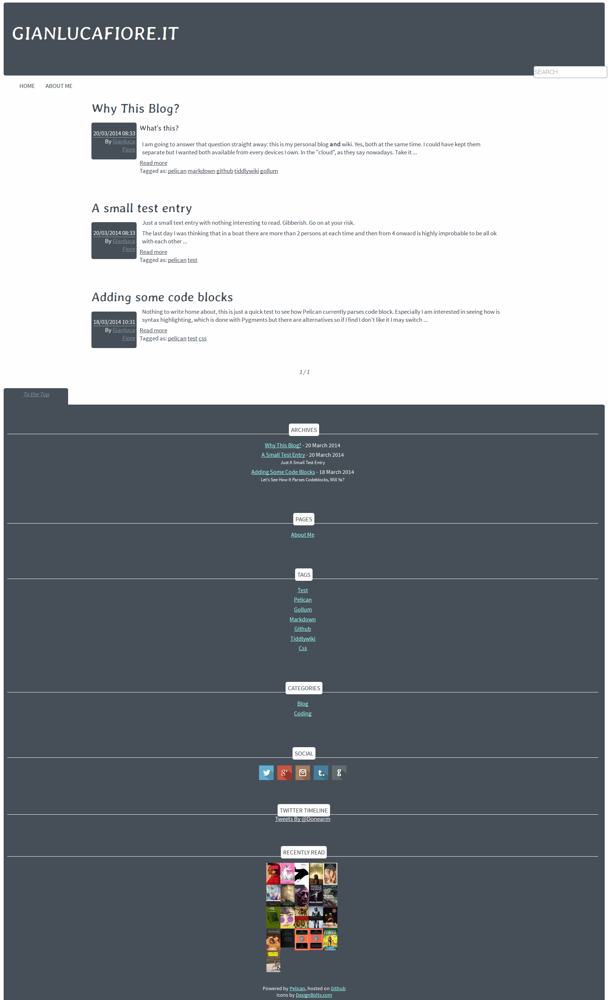
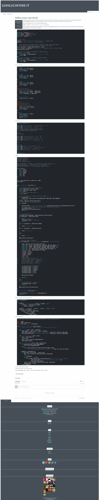

Grayarrow
=========

Minimal, responsive, theme for Pelican

Features
========

+ Responsive (smartphone, tablet and desktop)
+ Minimal (no js needed, no frameworks)
+ Twitter widget
+ Goodreads widget
+ Social icons
+ Disqus comments
+ Google Analytics
+ DuckDuckGo site search

Configuration Options
=====================

	DISQUS_SITENAME = ""
	TWITTER_USERNAME = ''
	TWITTER_WIDGET_ID = 
	GOODREADS_ID = 

all self-explanatory

	SOCIAL = (('twitter', 'http://twitter.com/Donearm'),
          ('google+', 'https://plus.google.com/115759514182038420985'),
          ('instagram', 'http://instagram.com/Donearm#'),
          ('tumblr', 'http://shonelikethesun.tumblr.com'),
          ('github', 'http://github.com/Donearm'),)

for the social icons in the footer

The Pygments highlighting has been customized to go with the colours of the theme. It is included under `static/css/`. The options I am using to enable it are
	
	MD_EXTENSIONS = ['codehilite(css_class=highlight)']
	PYGMENTS_RST_OPTIONS = {'linenostep': 5}

Plugins
=======

Grayarrow make use of the [Neighbours](https://github.com/getpelican/pelican-plugins/tree/master/neighbors) plugin. Download a copy in your plugins directory and add

	PLUGIN_PATH = "plugins"
	PLUGINS = ["neighbors"]

in your pelican.conf.py file

Preview
=======

Main/Index

Article 

License
=======

All files in this project are covered by the [GNU Affero General Public License](http://opensource.org/licenses/AGPL-3.0) unless otherwise explicitly stated
